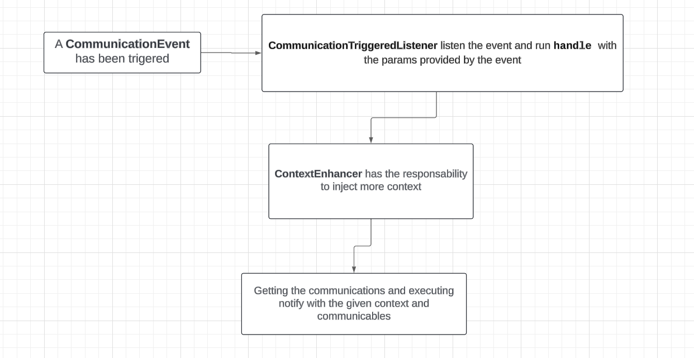
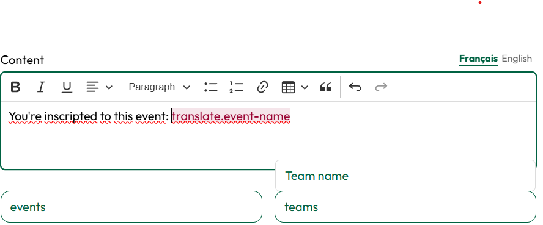

# Communications

## Concept of Working

This package provides a way to handle communications within your application. It allows you to set up triggers, manage variables, and enhance context for events.
The main idea is to have a way to send communications to users based on events that happen in the application. For example, you could send an email to a user when they register, or when they buy a product.

It provides a route */communication-templates* where you can edit/create the templates for the communications with variables and types of communications.

## Steps to Use It

### Installation

To install the package, run the following command:

```bash
composer require condoedge/communications
```

### Publishing configuration

To publish the configuration file, use the following command:

```bash
php artisan vendor:publish --tag="condoedge-communications-config"
```

### Publishing javascript (Needed for the CKeditor)

To publish the JavaScript files required for CKEditor, use the following command:

```bash
php artisan vendor:publish --tag="condoedge-communications-js"
```

### Setting communicables

Each kind of communications has their own interface to be implemented by the communicable model. For example, the EmailCommunicable model implements the EmailCommunicable interface. So if the communication is an email, the communicable model should implement the EmailCommunicable interface or it'll be ignored.

Our actual interfaces are:

- `EmailCommunicable`
- `SMSCommunicable`
- `DatabaseCommunicable` (Notifications)

### Setting Up Triggers



To set up a trigger, you need to create an event that will trigger the communication. Below is an example of how to create a trigger event:

```php
<?php

class RandomTriggerer implements CommunicableEvent
{
    use Dispatchable, InteractsWithSockets, SerializesModels;

    protected $event;
    protected $teamsIds;

    public function __construct($event)
    {
        $this->event = $event;
    }

    function getParams(): array
    {
        return [
            'event' => $this->event,
        ];
    }

    // If you don't set communicables, the communication won't be sent
    function getCommunicables(): array|Collection
    {
        return CommunicableRandom::where('event_id', $this->event->id)->get();
    }

    static function getName(): string
    {
        return __('translate.a-random-triggerer');
    }
}
```

Next, set the communication triggers in the kompo-communications config file:

```php
<?php

return [
    'triggers' => [
        OpenedReinscriptions::class,
    ],
];
```

## Introducing CKEditor



To implement CKEditor, use the _EnhancedEditor helper in your kompo component. In communications, it is used in the *EmailCommunicationHandler* to allow the user to write the email content with variables.

### Using Variables in CKEditor

To see variables in the editor, set the variables as follows:

```php
// AppServiceProvider.php
Variables::setVariables([
    'events' => [
        // ID, name, classes, automatic handling (access to the object and attribute)
        ['event.name_ev', 'Event name', 'bg-level1', true]
    ],
    'teams' => [
        ['team_name', 'Team name', 'bg-level1', false]
    ]
]);
```

### Replacing Content with Variables

The content will replace the variables in the text with the provided values. You can also use the automatic handling of the variables (`{model.attribute}`) for simple cases.

```php
// AppServiceProvider.php
ContentReplacer::setHandlers([
    'team_name' => function ($team) {
        return $team->name;
    }
]);
```

### Enhancing Context for Events

You can enhance the context that you'll provide in the events. You can also implement the `enhanceContext` method in the model to do this, which is often a better approach.

```php
ContextEnhancer::setEnhancers([
    'event' => function ($event) {
        return [
            'team' => $event->team,
            'teams_ids' => [$event->team_id],
        ];
    }
]);
```

or

```php
// RandomModel.php
public function enhanceContext()
{
    return [
        'team' => $this->team,
        'teams_ids' => [$this->team_id],
    ];
}
```

## Setting default communications for triggers

To set the default communications for each trigger, you can use the provided button on the list page. You need to configure the default communications for each trigger in the `resources\views\stubs\communication-templates` directory. The file structure should follow this format:

default-`{slugged-name-of-the-trigger}`-`{number-of-type-of-communications}`-`{locale-key}`.blade.php

For example: default-opened-reinscriptions-1-en.blade.php

The name of the trigger is given by $trigger::class.

Here's a breakdown of the numbering system for each type of communication:

- Email: 1
- SMS: 2
- Notification: 3

Make sure to update the appropriate file for each trigger and communication type.

## Sending communications ways

### Email

We use the Laravel Mail facade to send emails.
You should change the file `communication-layout.blade.php` to your email layout.

### SMS

We use the vonage API to send SMS.

### Database

We use the Laravel Notification system to send notifications with some enhancements to manage them. Giving the possibility to provide some custom notifications handlers.

### Extending sending ways

We don't have an easy way to do this. We'll need a refactor for do CommunicationType enum setteable from a config file. Now it's static.

We have an specific handler for each type of communications. Implementing a different way to send communications, and save them.
You should create a new handler and extends the `AbstractCommunicationHandler` class.

```php
class EmailCommunicationHandler extends AbstractCommunicationHandler
{
    public function communicableInterface()
    {
        return EmailCommunicable::class;
    }

    // NOTIFICATION

    /**
     * @param EmailCommunicable[] $communicables
     * @param mixed $params
     * @return void
     */
    public function notifyCommunicables(array $communicables, $params = [])
    {
        $layout = $params['layout'] ?? DefaultLayoutEmailCommunicable::class;
        
        $communicables = collect($communicables)->map(function($communicable) use ($layout, $params) {
            $params = ContextEnhancer::setCommunicable($communicable)->getEnhancedContext($params);

            Mail::to($communicable->getEmail())->send(new $layout($this->communication, $params));
        });
    }   
}
```
